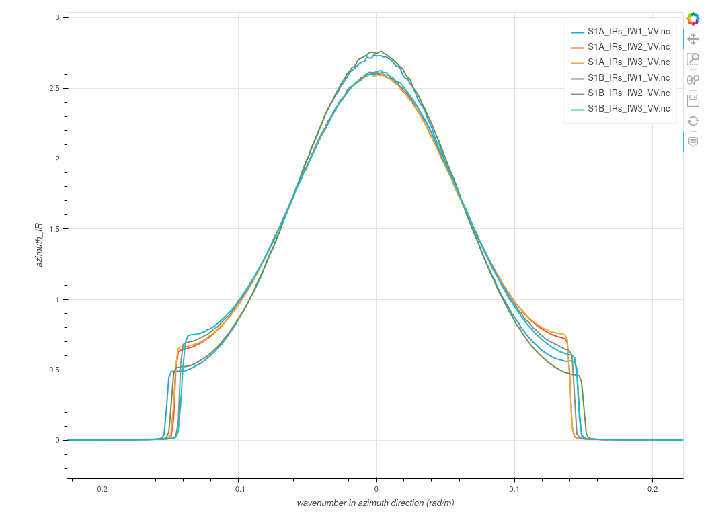

====================================
Algorithm Theoretical Basis Document
Sentinel 1 - L1B SLC
====================================

:Author: Frédéric Nouguier, Alexis Mouche, Bertrand Chapron, Gilles
         Guitton, Antoire Grouazel, ...
:Date: 2023-03-10

Computation of sublook cross-spectra (WV and IW products)
=========================================================

Deramping of digital numbers
----------------------------

Lets call :math:`DN(sample, line)` the 2D matrix of RAW digital numbers
with dimensions: sample (fast time) and line (slow time) provided in L1
SLC IW or WV products. Fast time is in the range direction and slow time
is the azimuth direction. Due to the TOPS mode of IWS acquisition, it is
mandatory to “deramp” the complex digital numbers in order to obtain
meaningful complex values. The deramping procedure has to be applied to
compensate for the antenna steering rate during the acquisition. The
deramping procedure do not need to be applied for Wave Mode acquisitions
because of the abscence of steering. The deramping procedure for IW
acquisitions follows the steps described in the ESA Technical note
COPE-GSEG-EOPG-TN-14-0025 : `“Definition of the TOPS SLC deramping
function for products generated by the S-1
IPF” <https://sentinel.esa.int/documents/247904/1653442/sentinel-1-tops-slc_deramping>`__

The deramped digital number writes:

.. math:: \overline{DN}=DN\mbox{$\text{e}$}^{\mbox{$\text{i}$}\phi}\qquad\text{with}\qquad\phi=-\pi k_t(\tau)(\eta-\eta_{ref})^2

Definition of :math:`\phi` and how to compute it from L1 SLC products is
described in `ESA Technical note
COPE-GSEG-EOPG-TN-14-0025 <https://sentinel.esa.int/documents/247904/1653442/sentinel-1-tops-slc_deramping>`__

Complex modulation signal
-------------------------

The SAR image cross-spectra is meant to quantify the spatial frequency
content of the cross-section modulations. The modulations are the
relative variation of the radar cross-section relatively to the “mean
radar cross section” of the image. As we are interested with the
frequency content due to wave modulation, we define the “mean radar
cross-section” as the average of the radar cross-section over a
prescribed image extension (typically 1 km x 1 km). It writes:

.. math:: I_{low} = |\overline{DN}|^2\star G

where :math:`\star` operators stands for the convolution and with
:math:`G` a normalized Gaussian-filter with a customizable 1 km x 1 km
standard deviations. The complex Digital Number modulations thus writes:

.. math::

   \label{DNmod}
   \widetilde{DN} = \dfrac{\overline{DN}}{\sqrt{I_{low}}}

Computation of azimuthal Doppler centroid
-----------------------------------------

Lets call :math:`rg` and :math:`az` as respectively the range and
azimuth spatial vectors associated with the selected image.
:math:`rg = \text{sample}\times d_{rg}` and
:math:`az = \text{line}\times d_{az}` where :math:`d_{rg}` and
:math:`d_{az}` are respectively the sample and line spacing in meters.
The azimuthal Doppler spectrum writes:

.. math::

   D(rg,f_{az}) = \left|\int \widetilde{DN}(rg,az) e^{-i2\pi f_{az}az} d_{az}\right|^2
   \label{dop}

The azimuthal Doppler centroid is the mean azimuth frequency of the
azimuthal Doppler spectrum. In order to get a good estimation of the
Doppler centroid, the average of the Doppler spectrum is computed on the
range direction:

.. math:: \overline{D}(f_{az}) = \left\langle D(rg,f_{az})\right\rangle_{rg}

An example of Doppler spectrum is represented on figure
`1 <#fig:dopplerspectrum>`__.

   Azimuthal Doppler spectrum

The azimuthal Doppler centroid is, by definition, the mean (first order
moment) of the Doppler spectrum, namely:

.. math::

   \label{def:centroid}
   DC \triangleq \dfrac{\int f_{az} \overline{D}(f_{az}) df_{az}}{\int\overline{D}(f_{az}) df_{az}}

However, since the azimuthal Doppler spectrum is not symmetric due to
windowing processing applied during the generation of the L1 SLC the
estimation of the DC using equation (`[def:centroid] <#def:centroid>`__)
is biaised. In practise, the DC is computed by fitting a Gaussian curve
on the Doppler spectrum to find the position of the maximum. This should
be updated in the future.

Computation of centered and normalized Doppler spectrum
-------------------------------------------------------

We noticed that the Doppler spectrum is not centered around zero nor
symmetric relatively to its maximum. Several explanations can be given
to explain this two characteristics. The not centered value of the
azimuthal centroid can be due, among others, to some geophysical aspects
such as the observed scene mean motion but also on some instrument
uncorrected geometry and uncompensated antenna properties. The
disymmetric shape can also be due to some uncompensated instrument
effect but also on applied signal processing such as windowing or
interpolation. In order to correctly further process the Doppler
spectrum, it is mandatory to compensate as much as possible these
effects with a two step processing:

-  centering the Doppler spectrum

-  Normalize the Doppler spectrum by the Impulse Response of the
   instrument

Centering the Doppler spectrum
~~~~~~~~~~~~~~~~~~~~~~~~~~~~~~

Centering the Doppler spectrum and computing the 2D Fourier Transform of
the complex modulation signal writes:

.. math:: FT^{2D}\left[\widetilde{DN}_c\right] = \int \widetilde{DN}(rg,az)\mbox{$\text{e}$}^{-i2\pi\ DC\ az} \mbox{$\text{e}$}^{-i2\pi (f_{az}az+f_{rg}rg} d_{az}d_{rg}\label{centereddop}

Normalization of the Doppler spectrum by the Impulse Response of the instrument
~~~~~~~~~~~~~~~~~~~~~~~~~~~~~~~~~~~~~~~~~~~~~~~~~~~~~~~~~~~~~~~~~~~~~~~~~~~~~~~

Figure `2 <#fig:azimuthIR_IW>`__ and `3 <#fig:rangeIR_IW>`__
respectively show the centered azimuthal and slant-range Impulse
Response of Sentinel-1 in VV polarization for the three subswath IW.
Figure `4 <#fig:azimuthIR_WV>`__ and `5 <#fig:rangeIR_WV>`__
respectively show the centered azimuthal and slant-range Impulse
Response of Sentinel-1 in VV polarization for the WV swath. These
Impulse Responses have been computed over homogeneous and motion-less
surfaces, averaged and stored. The dataset used to compute theses
response is avalibale here and the numerical code to produce them here.

   Azimuthal Impulse Response for IW subswathes in VV polarisation

.. figure:: ./figures/S1_range_IR_IW_VV.png
   :alt: Range Impulse Response for IW subswathes in VV polarisation
   :name: fig:rangeIR_IW

   Range Impulse Response for IW subswathes in VV polarisation

.. figure:: ./figures/S1_azimuth_IR_WV_VV.png
   :alt: Azimuthal Impulse Response for WV mode in VV polarisation
   :name: fig:azimuthIR_WV

   Azimuthal Impulse Response for WV mode in VV polarisation

.. figure:: ./figures/S1_range_IR_WV_VV.png
   :alt: Range Impulse Response for WV mode in VV polarisation
   :name: fig:rangeIR_WV

   Range Impulse Response for WV mode in VV polarisation

The normalization with the instrument Impuse Response is realized in the
Fourier domain and writes:

.. math:: FT^{2D}\left[\widetilde{\underline{DN_c}}\right](f_{rg},f_{az}) = \dfrac{FT^{2D}[\widetilde{DN}_c]}{\sqrt{IR_{rg}(f_{rg})}\sqrt{IR_{az}(f_{az})}}

with :math:`IR_{rg}` and :math:`IR_{az}` being the Impulse Response in
range and azimuth direction for the considered acquisition mode.

Extraction of azimuthal sublooks
--------------------------------

The extraction of azimuthal sublook is computed following the procedure:

-  Taking the Inverse Fourier Transform of
   :math:`FT^{2D}\left[\widetilde{\underline{DN_c}}\right]` in the range
   direction.

-  Slicing the returned azimuthal Doppler bandwidth into :math:`n`
   portions.

-  Taking the Inverse Fourier Transform of each portion in the azimuthal
   direction.

-  Normalizing each look energy.

-  Detect the look

They are evaluated as follow:

.. math:: FT^{1D}\left[\widetilde{\underline{DN_c}}\right](rg,f_{az}) = \dfrac{1}{2\pi}\int FT^{2D}\left[\widetilde{\underline{DN_c}}\right] \mbox{$\text{e}$}^{i2\pi f_{rg}rg} df_{rg}\

The second and third step corresponding to the extraction of look
:math:`i` writes:

.. math:: \widetilde{\underline{DN_c}}^i(rg,az) = \dfrac{1}{2\pi}\int FT^{1D}\left[\widetilde{\underline{DN_c}}\right](rg,f_{az})W_i(f_{az}) \mbox{$\text{e}$}^{i2\pi f_{az}az} df_{az}\

where :math:`W_i` is the weighting function corresponding to slice
:math:`i` in the azimuthal spectrum. Figure `4 <#>`__ shows
:math:`\left|FT^{1D}\left[\widetilde{\underline{DN_c}}\right](rg,f_{az})\right|^2`
averaged over the range direction and the weighting function of a look.

Detecting look :math:`i` and normalizing its energy finally writes:

.. math:: look^i(rg,az)=\dfrac{\left|\widetilde{\underline{DN_c}}^i\right|^2}{\sum_{rg,az}{\left|\widetilde{\underline{DN_c}}^i\right|^2}}

In practice, the width of the slicing function :math:`W_i` is defined
relatively to the total frequency range of the azimuthal Doppler
spectrum. The baseline processing relies on a division into 3 looks and
each look contains 25% of the total Doppler frequency range. The
remaining 25% are located at the two borders of the frequency axis
(12.5% on each side).

Sub-looks cross-spectra
-----------------------

Cross-spectra between look :math:`i` and look :math:`i+n` writes:

.. math:: XS^{n\tau}(f_{rg},f_{az})=FT^{2D}[look^i]\cdot FT^{2D}[look^{i+n}]^\star

where the :math:`\star` symbol stands for the complex conjugate and
where the definition of the 2D Fourier Transform :math:`FT^{2D}` is

.. math:: F(f_{rg},f_{az}) \triangleq FT^{2D}[f(rg,az)] = \iint f(rg,az) \mbox{$\text{e}$}^{-i2\pi(f_{az}az+f_{rg}rg)} d_{az}\ d_{rg}

The time separation “:math:`\tau`” between two consecutive sublooks
writes:

.. math:: \tau = SaD\times look_{sep}

where :math:`SaD` and :math:`look_{sep}` are respectively the Synthetic
aperture Duration [second] and the look separation. They writes:

.. math::

   \begin{aligned}
   SaD &=& \dfrac{c\times s}{2f_{r}V_{sat} \Delta_{az}}\\
   look_{sep} &=& look_{width}\times(1-look_{overlap})
   \end{aligned}

with :math:`c`, :math:`s`, :math:`f_r`, :math:`V_{sat}`,
:math:`\Delta_{az}` being respectively the speed of light, the slant
range distance, the radar frequency, the satellite ground velocity and
the azimuth spacing. In the baseline processing,
:math:`look_{width}=0.2` for IW, :math:`look_{width}=0.25` for WV and
:math:`look_{overlap}=0`.

Periodograms
------------

In practice, to reduce noise on the computed cross-spectra, the steps
above are applied on regions smaller than the full image (typically 2km
X 2km) and then are averaged. A kind of Welsh methodology.

Computation of the azimuthal cut-off
====================================

The azimuthal cut-off is a characteristic distance defining the maximum
wavelengh that the SAR was able to recover in the azimuth distance. It
characterize its effective azimuthal resolution. The sea surface waves
motion is responsible for a strong smeering in the azimuth direction.
This smeering effect largely increases with the wave motion and is a
good proxy for wind velocity.

The azimuthal cut-off is computed as follow.

-  Computation of covariance function as the Inverse Fourier Transform
   of the cross-spectrum

-  Averaging the covariance function on the range axis (or taking a
   transect)

-  Normalize by it maximum

-  Fit a Gaussian function and returns its standard deviation

The covariance function writes:

.. math:: \rho(rg,az) = IFT^{2D}\left[\Re e(XS^{n\tau})\right)

where :math:`\Re e` stands for the real part and where :math:`n=2` in
the baseline processing. A Gaussian fit is applied on
:math:`\underline{\rho}(az) = \dfrac{\rho(rg=0, az)}{\rho(rg=0, az=0)}`
over the range span [-500,500] in the baseline processing. In the
litterature, the Gaussian fit can also be done over the range averaged
covariance function :math:`\left\langle\rho(rg,az)\right\rangle_{rg}`.
The Gaussian fit is realized with a least square difference cost
function and a gradient descent methodology. The azimuthal cut-off
:math:`\lambda` is defined as the standard deviation of the fitted
function:

.. math:: \exp\left(\dfrac{-az^2}{2\lambda^2}\right)

Computation of calibrated denoised :math:`\sigma^0`
===================================================

Sentinel-1 Level-1 SLC product contains radiometric calibration Look-Up
table (LUT) and denoising LUT to compute the required quantity. This
procedure is recalled in this
`note <https://sentinel.esa.int/documents/247904/685163/s1-radiometric-calibration-v1.0.pdf>`__
and detailled in this
`document <https://sentinel.esa.int/documents/247904/2142675/Thermal-Denoising-of-Products-Generated-by-Sentinel-1-IPF>`__.
A short summerize recalled below can also be found
`here <https://sentinel.esa.int/web/sentinel/radiometric-calibration-of-level-1-products>`__

The radiometric calibration is applied by the following equation:

.. math:: value(i)=\dfrac{|DN_i|^2}{A_i^2}

where :math:`value(i)` can be :math:`\beta^0(i)`, :math:`\sigma^0(i)` or
:math:`\gamma(i)` depending of the used calibration table :math:`A_i` on
the digital number :math:`DN_i`. The :math:`A_i` LUT is provided at a
lower resolution than the :math:`DN` and should thus be bilinearly
interpolated.

The range and azimuth de-noise LUTs must be calibrated matching the
radiometric calibration LUT applied to the DN as:

.. math:: noise^{rg/az}(i)=\dfrac{|\eta^{rg/az}_i|^2}{A_i^2}

where :math:`\eta^{rg/az}_i` are the range and azimuth noise LUTs and
:math:`noise^{rg/az}(i)` are calibrated noise profiles depending on the
used calibration table :math:`A_i`.

The radiometrically calibrated and denoised :math:`\sigma^0` thus
writes:

.. math:: \sigma^0(i)=\dfrac{DN_i^2-\eta^{rg}_i\eta^{az}_i}{\Sigma^0_i}

where :math:`\eta^{rg}_i`, :math:`\eta^{az}_i` and :math:`\Sigma^0_i`
are respectively the range noise, azimuth noise and calibration LUT
interpolated over the Digital Number locations :math:`i`. It can be
noted that :math:`\eta^{rg}_i` is both range and azimuth dependent and
:math:`\eta^{az}_i` is azimuth dependent.

Computation of the sigma0 normalized variance
=============================================

The normalized variance is the variance of the Digital number defined
over a prescribed spatial extension. In the baseline L1B SLC processor,
the variance is computed at a tile level.

It writes:

.. math:: nv\triangleq\dfrac{\left\langle\left(m-\left\langle m\right\rangle\right)^2\right\rangle}{\left\langle m\right\rangle^2}

where :math:`m=\left|\widetilde{DN}\right|^2` and :math:`\widetilde{DN}`
is defined in equation (`[DNmod] <#DNmod>`__)
