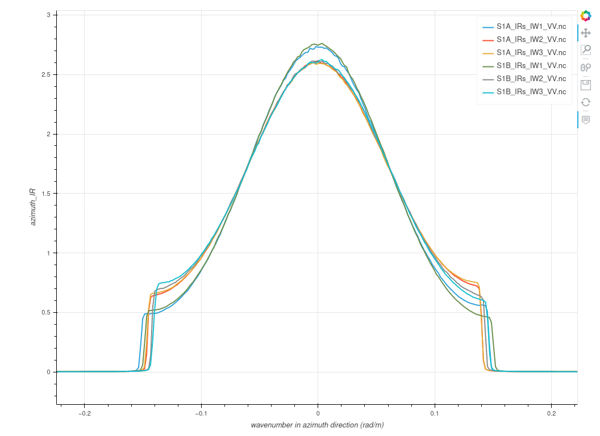
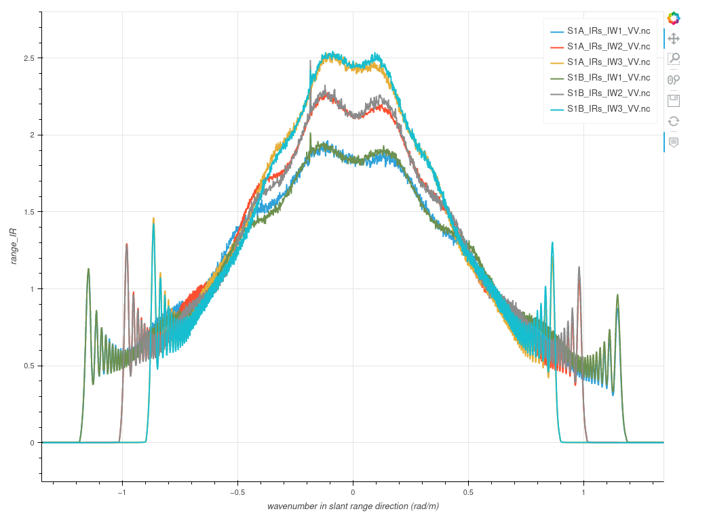
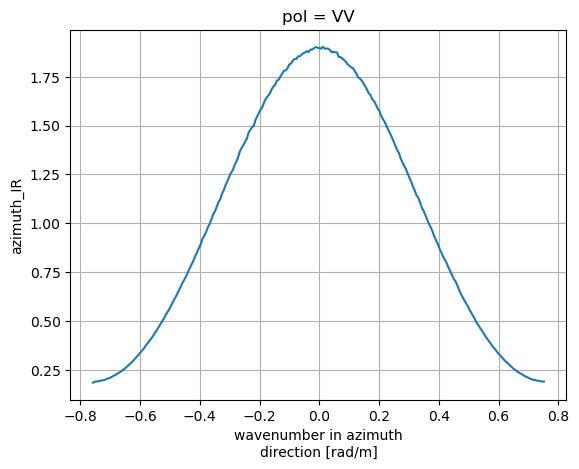
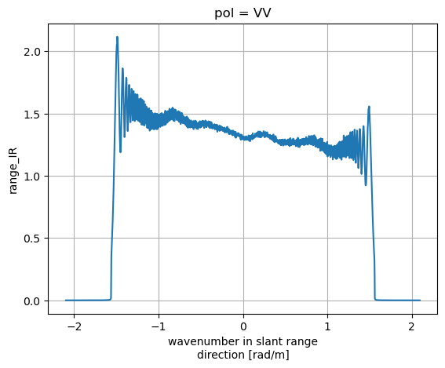

.. _crossspectra:

==========================================================
Computation of sub-look cross-spectra (WV and IW products)
==========================================================

Deramping of digital numbers
############################

Lets call :math:`DN(sample, line)` the 2D matrix of RAW digital numbers with dimensions: sample (fast time) and line (slow time) provided in L1 SLC IW or WV products.
Fast time is in the range direction and slow time is the azimuth direction.

Due to the TOPS mode of IWS acquisition, it is mandatory to ``deramp'' the complex digital numbers in order to obtain meaningful complex values.
  - The deramping procedure has to be applied to compensate for the antenna steering rate during the acquisition.
  - The deramping procedure do not need to be applied for Wave Mode acquisitions because of the absence of steering.
  - The deramping procedure for IW acquisitions follows the steps described in the ESA Technical note COPE-GSEG-EOPG-TN-14-0025 : `Definition of the TOPS SLC deramping function for products generated by the S-1 IPF <https://sentinel.esa.int/documents/247904/1653442/sentinel-1-tops-slc_deramping>`_.

The deramped digital number writes:

.. math::
   \overline{DN}=DNe^{i\phi}\qquad\text{with}\qquad\phi=-\pi k_t(\tau)(\eta-\eta_{ref})^2

Definition of :math:`\phi` and how to compute it from L1 SLC products is described in `ESA Technical note COPE-GSEG-EOPG-TN-14-0025 <https://sentinel.esa.int/documents/247904/1653442/sentinel-1-tops-slc_deramping>`_.

Complex modulation signal
#########################

The SAR image cross-spectra is meant to quantify the spatial frequency content of the cross-section modulations.
The modulations are the relative variation of the radar cross-section relatively to the ``mean radar cross section'' of the image.
As we are interested with the frequency content due to wave modulation, we define the ``mean radar cross-section'' as the average of the radar cross-section over a prescribed image extension (typically 1 km x 1 km).

It writes:

.. math::
   I_{low} = |\overline{DN}|^2\star G

where :math:`\star` operators stands for the convolution and with :math:`G` a normalized Gaussian-filter with a customizable 1 km x 1 km standard deviations.

The complex Digital Number modulations thus writes:

.. math::
  :label: DNmod

    \widetilde{DN} = \dfrac{\overline{DN}}{\sqrt{I_{low}}}

Computation of azimuthal Doppler centroid
#########################################

Lets call :math:`rg` and :math:`az` as respectively the range and azimuth spatial vectors associated with the selected image.
:math:`rg = \text{sample}\times d_{rg}` and :math:`az = \text{line}\times d_{az}` where :math:`d_{rg}` and :math:`d_{az}` are respectively the sample and line spacing in meters.
The azimuthal Doppler spectrum writes:

.. math::
  :label: dop

    D(rg,f_{az}) = \left|\int \widetilde{DN}(rg,az) e^{-i2\pi f_{az}az} d_{az}\right|^2

The azimuthal Doppler centroid is the mean azimuth frequency of the azimuthal Doppler spectrum. In order to get a good estimation of the Doppler centroid, the average of the Doppler spectrum is computed on the range direction:

.. math::
    \overline{D}(f_{az}) = \left\langle D(rg,f_{az})\right\rangle_{rg}

An example of Doppler spectrum is represented on figure :numref:`S1_azimuth_IR_IW_VV_1` .

The azimuthal Doppler centroid is, by definition, the mean (first order moment) of the Doppler spectrum, namely:

.. math::
  :label: centroid

    DC \triangleq \dfrac{\int f_{az} \overline{D}(f_{az}) df_{az}}{\int\overline{D}(f_{az}) df_{az}}

However, since the azimuthal Doppler spectrum is not symmetric due to windowing processing applied during the generation
of the L1 SLC the estimation of the DC using equation :eq:`centroid` is biased.
In practise, the DC is computed by fitting a Gaussian curve on the Doppler spectrum to find the position of the maximum.

.. note::
   This should be updated in the future.

Computation of centered and normalized Doppler spectrum
#######################################################

We noticed that the Doppler spectrum is not centered around zero nor symmetric relatively to its maximum.
Several explanations can be given to explain this two characteristics.
The not centered value of the azimuthal centroid can be due, among others, to some geophysical aspects such as the observed scene mean motion but also on some instrument uncorrected geometry and uncompensated antenna properties.

The disymmetric shape can also be due to some uncompensated instrument effect but also on applied signal processing such as windowing or interpolation.

In order to correctly further process the Doppler spectrum, it is mandatory to compensate as much as possible these effects with a two step processing:

1. centering the Doppler spectrum
2. Normalize the Doppler spectrum by the Impulse Response of the instrument

Centering the Doppler spectrum
++++++++++++++++++++++++++++++

Centering the Doppler spectrum and computing the 2D Fourier Transform of the complex modulation signal writes:

.. math::
    :label: centereddop

    FT^{2D}\left[\widetilde{DN}_c\right] = \int \widetilde{DN}(rg,az)e^{-i2\pi\ DC\ az} e^{-i2\pi (f_{az}az+f_{rg}rg} d_{az}d_{rg}

Normalization of the Doppler spectrum by the Impulse Response of the instrument
+++++++++++++++++++++++++++++++++++++++++++++++++++++++++++++++++++++++++++++++

These Impulse Responses have been computed over homogeneous and motion-less surfaces, averaged and stored.
The dataset used to compute theses response is available here and the numerical code to produce them here.

The normalization is performed by :py:mod:`xsarslc.processing.intraburst.compute_looks` method.

.. _s1_azimuth_ir_iw_vv:

this is a caption of the first figure.

Figure :numref:`Image of Sphinx (Fig. %s) <s1_azimuth_ir_iw_vv>` and :numref:`S1_range_IR_IW_VV` respectively show the centered azimuthal and slant-range Impulse Response of Sentinel-1 in VV polarization for the three sub-swath IW.

Figure :numref:`Image of Sphinx (Fig. %s) <S1_azimuth_IR_WV_VV>` and :numref:`S1_range_IR_WV_VV` respectively show the centered azimuthal and slant-range Impulse Response of Sentinel-1 in VV polarization for the WV swath.

The normalization with the instrument Impulse Response is realized in the Fourier domain and writes:

.. math::
   FT^{2D}\left[\widetilde{\underline{DN_c}}\right](f_{rg},f_{az}) = \dfrac{FT^{2D}[\widetilde{DN}_c]}{\sqrt{IR_{rg}(f_{rg})}\sqrt{IR_{az}(f_{az})}}

with :math:`IR_{rg}` and :math:`IR_{az}` being the Impulse Response in range and azimuth direction for the considered acquisition mode.

.. note::
   in `xsarslc` library the methods to estimate the Impulse Response are :py:func:`xsarslc.processing.impulseResponse.compute_IWS_subswath_Impulse_Response` and :py:func:`xsarslc.processing.impulseResponse.compute_WV_Impulse_Response`

Extraction of azimuthal sub-looks
#################################

The extraction of azimuthal sub-look is computed following the procedure:

1. Taking the Inverse Fourier Transform of :math:`FT^{2D}\left[\widetilde{\underline{DN_c}}\right]` in the range direction.
2. Slicing the returned azimuthal Doppler bandwidth into :math:`n` portions.
3. Taking the Inverse Fourier Transform of each portion in the azimuthal direction.
4. Normalizing each look energy.
5. Detect the look

They are evaluated as follow:

.. math::
   FT^{1D}\left[\widetilde{\underline{DN_c}}\right](rg,f_{az}) = \dfrac{1}{2\pi}\int FT^{2D}\left[\widetilde{\underline{DN_c}}\right] e^{i2\pi f_{rg}rg} df_{rg}

The second and third step corresponding to the extraction of look :math:`i` writes:

.. math::
    \widetilde{\underline{DN_c}}^i(rg,az) = \dfrac{1}{2\pi}\int FT^{1D}\left[\widetilde{\underline{DN_c}}\right](rg,f_{az})W_i(f_{az}) e^{i2\pi f_{az}az} df_{az}

where :math:`W_i` is the weighting function corresponding to slice :math:`i` in the azimuthal spectrum.

Figure \ref{} shows :math:`\left|FT^{1D}\left[\widetilde{\underline{DN_c}}\right](rg,f_{az})\right|^2` averaged over the range direction and the weighting function of a look.

Detecting look :math:`i` and normalizing its energy finally writes:

.. math::
   look^i(rg,az)=\dfrac{\left|\widetilde{\underline{DN_c}}^i\right|^2}{\sum_{rg,az}{\left|\widetilde{\underline{DN_c}}^i\right|^2}}

In practice, the width of the slicing function :math:`W_i` is defined relatively to the total frequency range of the azimuthal Doppler spectrum.
The baseline processing relies on a division into 3 looks and each look contains 25\% of the total Doppler frequency range.
The remaining 25\% are located at the two borders of the frequency axis (12.5\% on each side).

Sub-looks cross-spectra
#######################

Cross-spectra between look :math:`i` and look :math:`i+n` writes:

.. math::
    XS^{n\tau}(f_{rg},f_{az})=FT^{2D}[look^i]\cdot FT^{2D}[look^{i+n}]^\star

where the math:`\star` symbol stands for the complex conjugate and where the definition of the 2D Fourier Transform math:`FT^{2D}` is

.. math::
   F(f_{rg},f_{az}) \triangleq FT^{2D}[f(rg,az)] = \iint f(rg,az) e^{-i2\pi(f_{az}az+f_{rg}rg)} d_{az}\ d_{rg}

The time separation '':math:`\tau`'' between two consecutive sub-looks writes:

.. math::
   \tau = SaD\times look_{sep}

where :math:`SaD` and :math:`look_{sep}` are respectively the Synthetic aperture Duration [second] and the look separation.

They writes:

.. math::
   \begin{eqnarray}
   SaD &=& \dfrac{c\times s}{2f_{r}V_{sat} \Delta_{az}}\\
   look_{sep} &=& look_{width}\times(1-look_{overlap})
   \end{eqnarray}

with :math:`c`, :math:`s`, :math:`f_r`, :math:`V_{sat}`, :math:`\Delta_{az}` being respectively the speed of light, the slant range distance, the radar frequency, the satellite ground velocity and the azimuth spacing.
In the baseline processing, :math:`look_{width}=0.2` for IW, :math:`look_{width}=0.25` for WV and :math:`look_{overlap}=0`.

Periodograms
############

In practice, to reduce noise on the computed cross-spectra, the steps above are applied on regions smaller than the
full image (typically  2 km X 2 km) and then are averaged. A kind of Welsh methodology.