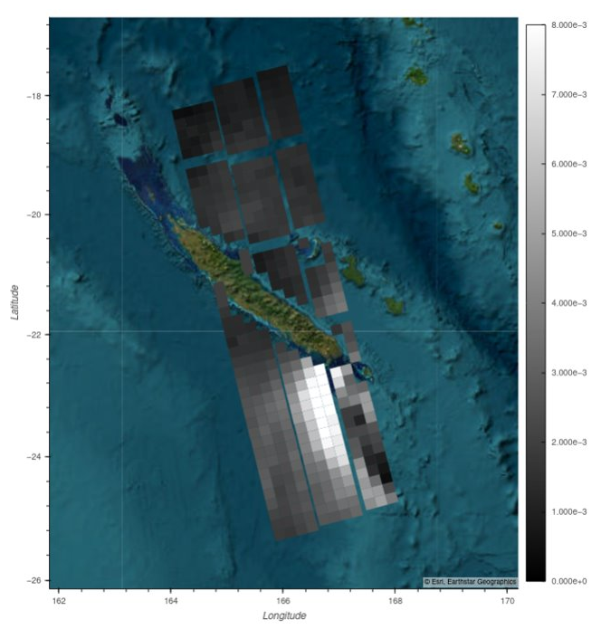

.. _sigma0:

***************************************************
Computation of calibrated denoised sigma0
***************************************************

Sentinel-1 Level-1 SLC product contains radiometric calibration Look-Up Table (LUT) and denoising LUT to compute the required quantity.
This procedure is recalled in this `note <https://sentinel.esa.int/documents/247904/685163/s1-radiometric-calibration-v1.0.pdf>`_
and detailed in this `document <https://sentinel.esa.int/documents/247904/2142675/Thermal-Denoising-of-Products-Generated-by-Sentinel-1-IPF>`_.
A short summarize recalled below can also be found `here <https://sentinel.esa.int/web/sentinel/radiometric-calibration-of-level-1-products>`_.

The radiometric calibration is applied by the following equation:

.. math::
   value(i)=\dfrac{|DN_i|^2}{A_i^2}

where :math:`value(i)` can be :math:`\beta^0(i)`, :math:`\sigma^0(i)` or :math:`\gamma(i)` depending of the used
calibration table :math:`A_i` on the digital number :math:`DN_i`. The :math:`A_i` LUT is provided at a lower resolution than the :math:`DN` and should thus be bi-linearly interpolated.

The range and azimuth de-noise LUTs must be calibrated matching the radiometric calibration LUT applied to the DN as:

.. math::
    noise^{rg/az}(i)=\dfrac{|\eta^{rg/az}_i|^2}{A_i^2}

where :math:`\eta^{rg/az}_i` are the range and azimuth noise LUTs and :math:`noise^{rg/az}(i)` are calibrated noise profiles depending on the used calibration table :math:`A_i`.

The radiometrically calibrated and denoised :math:`\sigma^0` thus writes:

.. math::
    \sigma^0(i)=\dfrac{DN_i^2-\eta^{rg}_i\eta^{az}_i}{\Sigma^0_i}

where :math:`\eta^{rg}_i`, :math:`\eta^{az}_i` and :math:`\Sigma^0_i` are respectively the range noise,
azimuth noise and calibration LUT interpolated over the Digital Number locations :math:`i`.

.. note::
   :math:`\eta^{rg}_i` is both range and azimuth dependent and :math:`\eta^{az}_i` is azimuth dependent.

Sentinel-1 IW SLC L1B SARWAVE VV polarization sigma0 denoised (one value per intra burst tile) over Tropical Cyclone NIRAN 2021 (New Caledonia)

Sentinel-1 IW SLC L1B SARWAVE VH polarization sigma0 denoised (one value per intra burst tile) over Tropical Cyclone NIRAN 2021 (New Caledonia)
